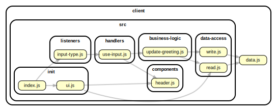

<!-- BEGIN TITLE -->

# DOCS

<!-- END TITLE -->

<!-- BEGIN TREE -->

> [interactive graph](./dependency-graph.html)

<!-- END TREE -->

<!-- BEGIN TOC -->

- public
- src
  - business-logic
    - [update-greeting.js](#clientsrcbusiness-logicupdate-greetingjs)
  - components
    - [header.js](#clientsrccomponentsheaderjs)
  - data-access
    - [read.js](#clientsrcdata-accessreadjs)
    - [write.js](#clientsrcdata-accesswritejs)
  - handlers
    - [use-input.js](#clientsrchandlersuse-inputjs)
  - init
    - [index.js](#clientsrcinitindexjs)
    - [ui.js](#clientsrcinituijs)
  - listeners
    - [input-type.js](#clientsrclistenersinput-typejs)
  - utils
- styles
- [data.js](#clientdatajs)

---

<!-- END TOC -->

<!-- BEGIN DOCS -->

# /public

---

# /src

## /business-logic

<a href="../../client/src/business-logic/update-greeting.js" id="clientsrcbusiness-logicupdate-greetingjs">../client/src/business-logic/update-greeting.js</a>

---

## /components

<a href="../../client/src/components/header.js" id="clientsrccomponentsheaderjs">../client/src/components/header.js</a>

## header ⇒ <code>HTMLHeadingElement</code>

Renders some text into a header with class "fancy".

**Returns**: <code>HTMLHeadingElement</code> - A header containing the text.

| Param  | Type                | Default                               | Description         |
| ------ | ------------------- | ------------------------------------- | ------------------- |
| [text] | <code>string</code> | <code>&quot;&#x27;&#x27;&quot;</code> | The text to render. |

---

## /data-access

<a href="../../client/src/data-access/read.js" id="clientsrcdata-accessreadjs">../client/src/data-access/read.js</a>

<a href="../../client/src/data-access/write.js" id="clientsrcdata-accesswritejs">../client/src/data-access/write.js</a>

---

## /handlers

<a href="../../client/src/handlers/use-input.js" id="clientsrchandlersuse-inputjs">../client/src/handlers/use-input.js</a>

---

## /init

<a href="../../client/src/init/index.js" id="clientsrcinitindexjs">../client/src/init/index.js</a>

<a href="../../client/src/init/ui.js" id="clientsrcinituijs">../client/src/init/ui.js</a>

---

## /listeners

<a href="../../client/src/listeners/input-type.js" id="clientsrclistenersinput-typejs">../client/src/listeners/input-type.js</a>

---

## /utils

---

---

# /styles

---

<a href="../../client/data.js" id="clientdatajs">../client/data.js</a>

<!-- END DOCS -->
